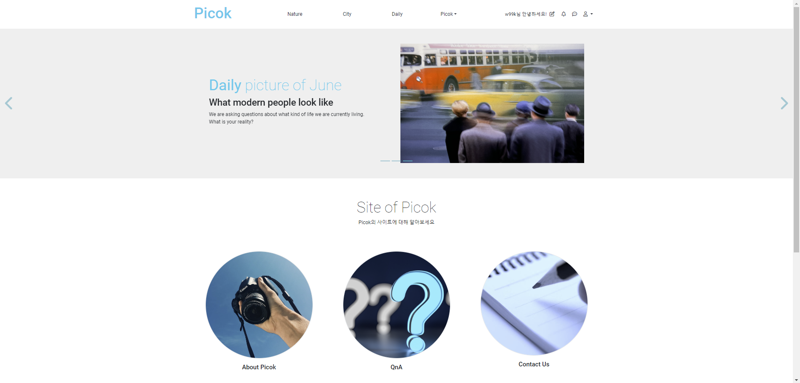
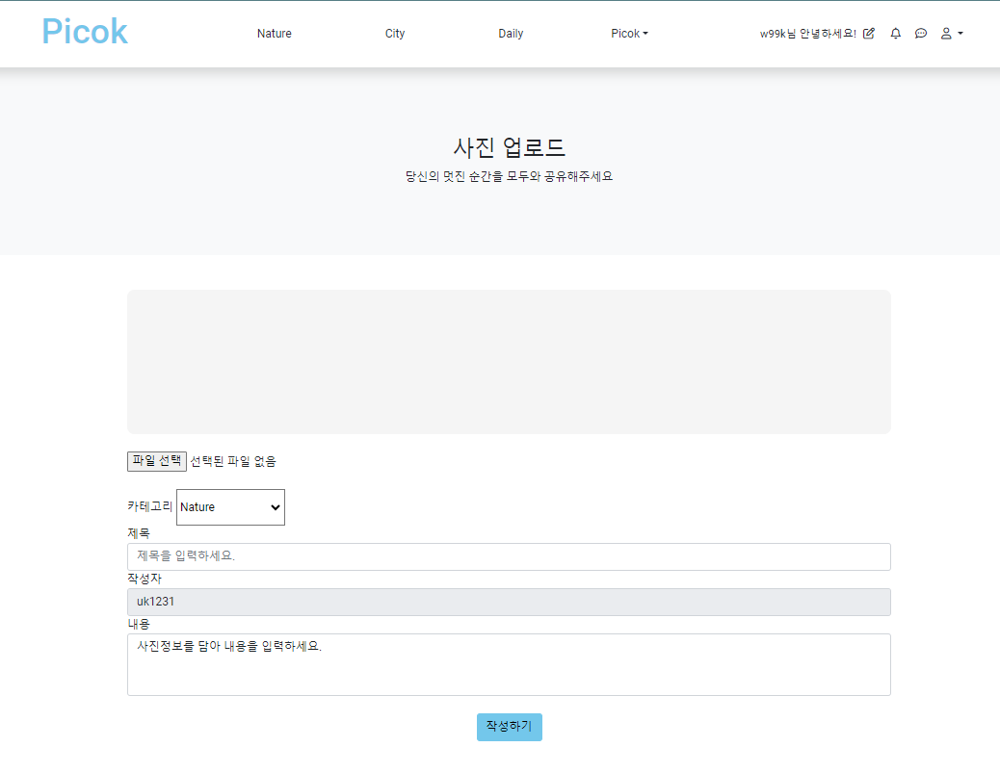

# Project_PICOK | 사진 아카이브 소셜미디어

Spring Framework로 제작한 팀 프로젝트 입니다. 
📆 2023.06. ~ 2023.09. 📆
 

## 📢 프로젝트 소개
- 프로젝트 개발 배경
  - 최초로 프로젝트의 주제를 선정할 때, 사용자들이 본인의 사진을 공유하고 상품화하여 사진을 사고팔 수 있는 웹 사이트를 제작하고자 했습니다.
  - 하지만, 사용자들의 거래로 특정 사용자의 불이익과 웹 사이트의 이미지 실추 및 프로젝트의 방향성과 맞지 않다고 판단하여 결제 시스템을 제외한, 사진 아카이브 소셜미디어로 진행하게 되었습니다.

- 역할과 기능 특징
  - 팀의 조장을 맡아 전반적인 프로젝트의 주제선정과 기획을 주도하였습니다.
  - 데이터베이스 테이블과 컬럼등의 연관관계를 구성하여 각 기능의 값을 문제 없이 받아내도록 설계했습니다.
  - 저는 게시판 카테고리 분류와 게시판 페이지네이션, 게시글을 구현하여 백엔드 개발을 담당했습니다.
  - 📖 게시판 📖
  - 게시글 작성 시 카테고리를 설정하여 제목과, 내용을 기입 후 작성완료하게 되면 해당 카테고리로 업로드 됩니다.
  - 카테고리마다 페이지네이션을 구현하여 처음, 이전, 1 ~ 10, 다음, 마지막 버튼은 해당 페이지로 이동하게 됩니다.
  - 📖 게시글 📖
  - 작성자와 사용자의 구분을 두어, 작성자는 수정/삭제 버튼을 활성화 시키고 사용자는 좋아요/신고 버튼을 활성화 시켰습니다. 단 비회원은 게시글을 볼 수 있지만 이벤트의 제한을 받습니다.
  - 작성자가 글을 수정하게 되면 수정페이지로 이동하여 첨부파일(사진), 제목, 내용을 수정할 수 있습니다. 단 작성자의 이름은 enable 처리하여 수정할 수 없습니다.
  - 작성자가 글을 삭제하게 되면 해당되었던 카테고리의 첫 번째 페이지로 이동하게 됩니다.
  - 작성자와 사용자 모두 댓글과 대댓글 이벤트를 사용할 수 있습니다.
  - 사용자의 무분별한 이벤트 처리를 막고자 좋아요/조회수/신고 기능에 할당하는 값을 고유 ip로 설정하여 증가값은 ip당 1회 증가하도록 했습니다.
  - 사용자가 최초로 게시글에 들어오게 되면 조회수가 1 증가하고, 추가적으로 다시 들어올 경우 ip당 1회 증가값을 갖기 때문에 더이상 증가하지 않습니다.
  - 사용자가 좋아요를 누르면 좋아요 증가값은 위와 동일하게 1 증가되고, 좋아요 취소버튼이 활성화될 시 이벤트를 처리하면 -1 감소하게 됩니다.
  - 사용자가 게시글을 신고할 경우 신고완료 버튼으로 disabled 처리되어 신고 누적값이 설정한 값에 도달하게 되면 게시글은 자동 삭제되도록 구현했습니다.
  - 📖 데이터베이스 📖
  - 게시글의 각 이벤트는 게시글(Board)을 외래키로 받고, 이벤트의 일괄 처리는 CASCADE 처리하여 데이터베이스 로직을 설계했습니다.
  - 위와 마찬가지로 작성자(member)의 외래키를 통해 게시글(Board) CASCADE 처리 로직을 설계했습니다.
 
 - 결과 및 성과
   - 팀장의 역할로 프로젝트를 성공적으로 완료하였으며, 사용자들이 효율적으로 게시글을 공유하고 소통할 수 있는 Spring 프로그램을 구현했습니다.
   - 게시글 이벤트 모든 부분 기여하여 성공적인 게시글 이벤트 처리를 구현했습니다.
  
 - 어려웠던 점과 극복 방법
   - 프로젝트 설계 단계에서 데이터베이스 테이블간의 연관관계를 고려하여 외래키를 어떻게 참조할지에 대하여 많은 고민을 했습니다.
   - 회의를 통하여 방안을 모색하던 중 Oracle 서재에 있는 외래키 자료를 보고 비슷한 예제를 수집하여 쓰임이 많은 사용자(Member)와 게시글(Board)을 기준으로 각 이벤트들이 참조하도록 설계했습니다.
   - 또한 각 이벤트들의 로직을 참조하는 테이블에 CASCADE 처리하여 일괄적인 데이터 처리를 설계했습니다.
   - 누적되는 게시글의 이벤트(신고/좋아요/조회수)를 방지하기 위해 단순히 숫자를 지정하여 구현하는 방법보다 더 나은 접근 방식을 고민했습니다.
   - 그러던 중 식별 가능한 컴퓨터의 ip는 그것만으로 고유한 ip이기에 방대한 양의 누적되는 데이터를 방지할 수 있다고 판단하여 이와 같은 방식으로 구현했습니다.

  - 배운 점과 성장
    - 프로젝트를 이끌어가는 버팀목이 되어 팀원간 소통과 협업으로 완전한 프로젝트를 구현할 수 있어서 소통과 협업의 중요성을 다시금 깨닫게 되었습니다.
    - 백앤드를 담당하여 기능 구현과 데이터 값을 다루는 등 프로젝트의 전체 흐름을 이해하고 웹사이트 제작에 큰 경험이 되었습니다.
    - PICOK 프로젝트를 바탕으로 더 나은 성장을 위하여 나아갈 수 있습니다.
   

## ⚙️ 프로젝트 기능

### 📺 최초 화면 📺
프로젝트를 실행한 메인 화면입니다.

  

 

- 'Nature'/'City'/'Daily' 세개의 카테고리(테마)를 선택하여 게시판을 볼 수 있고, 이 외에 'About Picok(회사 소개)', 'QnA(질의 응답)', 'Contact Us(이메일 문의)'등 다양한 이벤트를 제공합니다.
- 우측 상단에 연필 아이콘(✍️)을 클릭하면 글 작성 페이지로 넘어가게 됩니다.

### ✍️ 글 작성 ✍️
글 작성 시 보이는 최초 화면입니다.

  

 

- 첨부파일(.jpg/.png)을 선택한 후 카테고리(테마) 설정, 제목, 내용을 기입한 뒤 작성하기 버튼을 클릭할 시 업로드 됩니다.
- 👉 <a href="https://github.com/wooksun/Project_PICOK_Spring/blob/master/readme/upload.md" target="_blank">글 작성의 설명 및 구동 바로가기</a> 👈

### ✨ 카테고리(테마)별 분류 및 페이지네이션 ✨
글 작성 시 보이는 최초 화면입니다.

   👈
