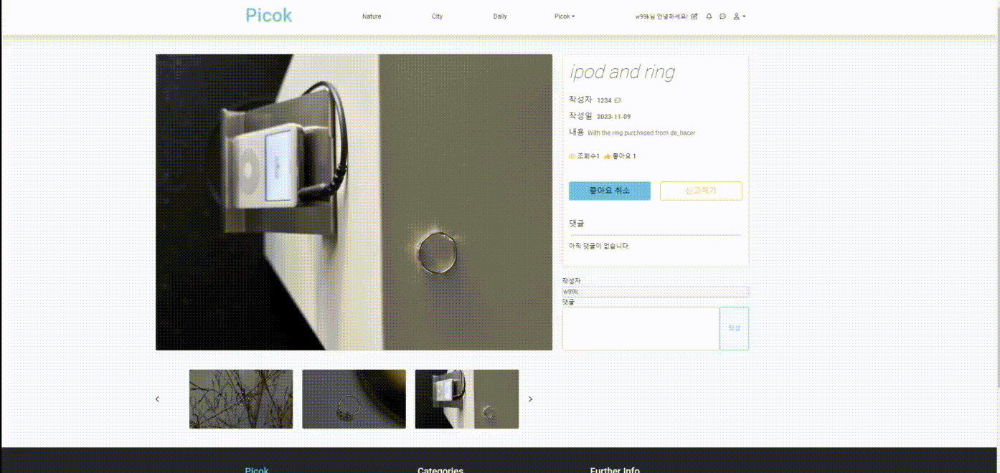
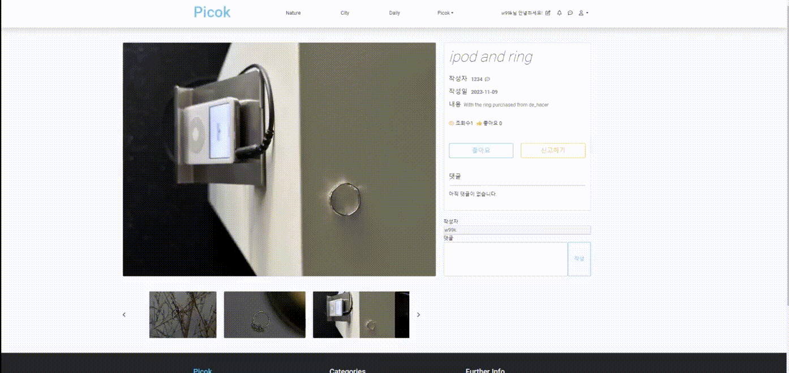
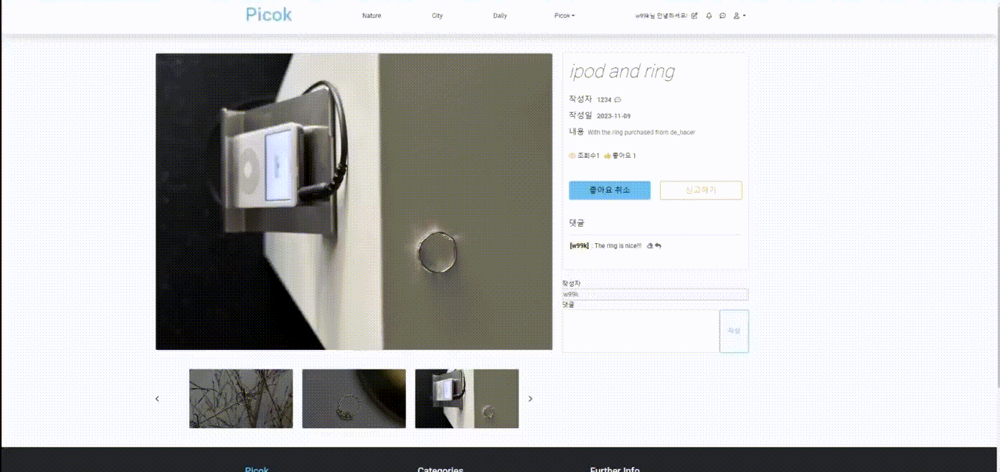
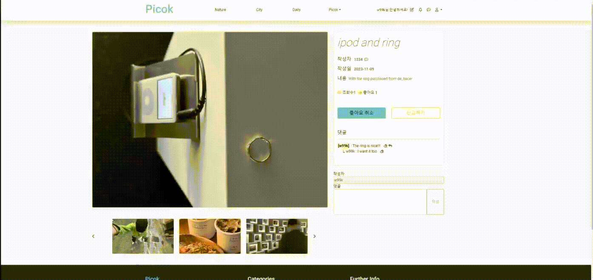
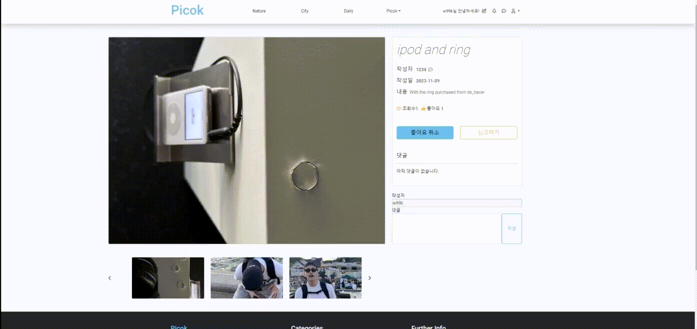

# Project_PICOK | 사진 아카이브 소셜미디어 - 게시글 이벤트 처리

게시글의 다양한 이벤트 처리에 대한 설명 및 구동입니다.

### 🎞 이미지 슬라이드

  

 

- 작성자가 업로한 게시글의 사진을 이미지 슬라이드 처리하여 다양한 게시글을 볼 수 있도록 구현했습니다.
- 슬라이드 이미지 클릭 시, 해당 게시글로 이동할 수 있습니다.
- 이미지 슬라이드 양쪽에 위치한 '<', '>' 버튼을 클릭하면 이전 슬라이드와 다음 슬라이드로 갈 수 있도록 구현했습니다.

### 👍 좋아요

  

 

- 사용자는 원하는 게시글에 들어가 좋아요 이벤트를 사용할 수 있습니다.
- '좋아요' 버튼을 클릭하면 좋아요 수가 1증가하고, '좋아요 최소' 버튼이 생성됩니다.
- '좋아요 취소' 버튼을 클릭하면 증가한 좋아요 수가 1감소하고, '좋아요' 버튼이 생성됩니다.

### ✉️ 댓글

  

 

- 작성자와 사용자 모두 댓글 이벤트를 사용할 수 있습니다.
- 아래 위치한 'textarea'에 입력할 댓글의 내용을 작성한 후, 작성하기 버튼을 클릭하면 이벤트가 발생합니다.

### ✉️ 대댓글

  

 

- 사용자의 편리한 대댓글 작성을 위해 댓글에 표시된 '↩︎' 버튼을 클릭하면 ajax 처리한 'textarea'가 해당 댓글 바로 아래 생성됩니다.
- 'textarea'에 입력할 대댓글의 내용을 작성한 후, 작성하기 버튼을 클릭하면 해당 댓글 아래에 대댓글이 출력됩니다.

### ✉️ 댓글과 대댓글 생성 및 삭제

  

 

- 댓글과 대댓글 모두 문제없이 생성 및 삭제가 가능하도록 구현했습니다.
- 댓글과 대댓글은 개별 삭제가 가능하고, 대댓글이 달린 댓글을 삭제할 경우 'CASCADE' 처리하여 댓글의 모든 내용(대댓글 포함)이 삭제됩니다.

### 🚨 신고

  

 

- 사용자가 게시글을 신고하려고 할 때, 신고하기 버튼을 클릭하여 게시글을 신고할 수 있습니다.
- 게시글을 신고하면 게시글이 저장된 카테고리로 이동하게 되고, 신고한 게시글을 들어가면 disabled 처리된 '신고완료' 버튼이 출력됩니다.

  

 

- 신고수는 컴퓨터의 고유 ip값을 받아 처리하여 무분별한 신고처리를 방지했습니다.
- 특정 게시글의 신고수가 100개 이상일 경우 해당 게시글은 자동 삭제되도록 구현했습니다. 
