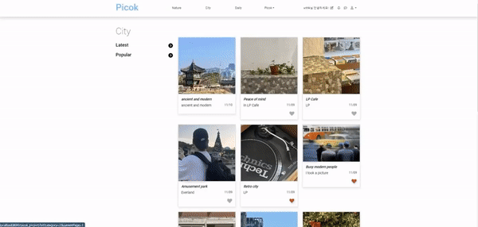

# Project_PICOK | 사진 아카이브 소셜미디어 - 카테고리 분류 및 페이지네이션 

카테고리 분류 및 페이지네이션에 대한 설명 및 구동입니다.

### 📋 페이지네이션(페이징) 📋

  

 

- '처음'/'이전'/'1 ~ 10'/'다음'/'마지막' 버튼을 활성화하고, 1 ~ 10사이의 숫자는 i라는 값을 두어 게시글이 12개 이상 게시되면 1증가합니다.
- 출력된 버튼을 클릭시 해당되는 주소로 이벤트 처리되고, 숫자 페이지는 10단위로 설정하여 원하는 페이지로 이동 가능합니다. (ex: 1 ~ 10, 11 ~ 20 ...)

  

 

- 'City' 카테고리의 경우 14개의 게시글이 저장되어 총 2페이지 분량의 페이지네이션이 생성됩니다.
- 'Daily' 카테고리의 경우 게시글이 12개 미만이 기  때문에 1페이지의 페이지네이션이 생성됩니다.

### 👍 최신/좋아요 순 정렬 👍

  

 

- 정렬의 기본값은 'Latest(최신순)' 정렬입니다.
- 게시글마다 보이는 하트는 작성자 본인의 게시글에는 보이지 않고, 다른 작성자의 게시글에게만 보이게 되어 클릭 시 좋아요 이벤트 처리가 이루어집니다.
- 위를 바탕으로 '좋아요(Popular)' 정렬 시 하트가 클릭 된 게시글이 보여지게 되고, 이 중 좋아요의 개수가 가장 많은 게시글이 맨 첫 번쨰에 위치하게 됩니다.
- Latest 클릭 시 다시 최신순 정렬이 가능합니다.

👉 <a href="https://github.com/wooksun/Project_PICOK_Spring" target="_blank">Project_PICOK 보러가기</a> 👈
