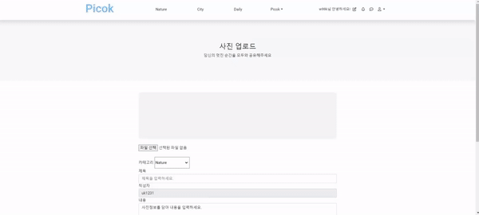
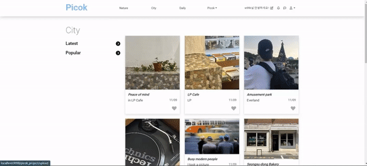
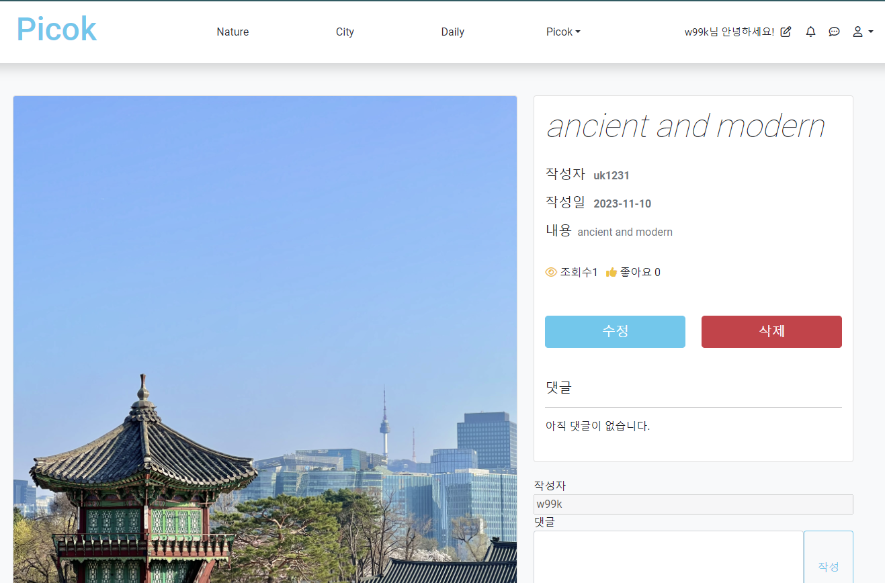
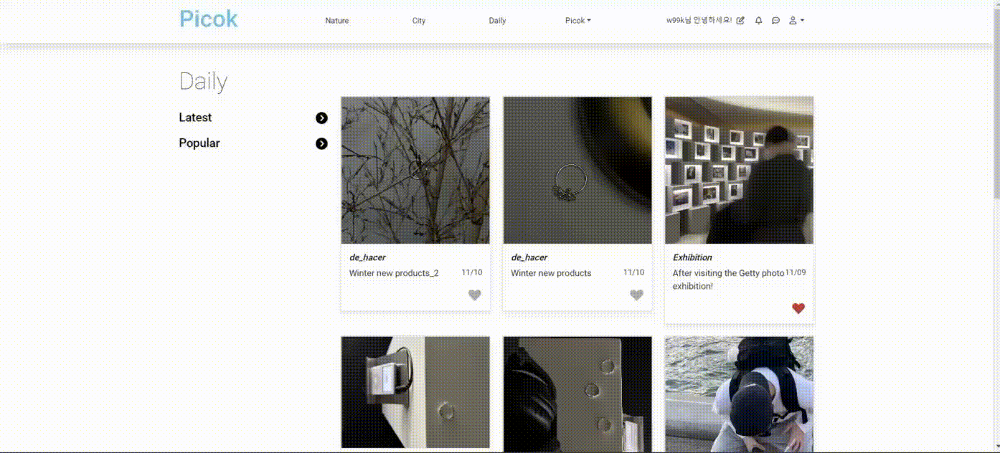
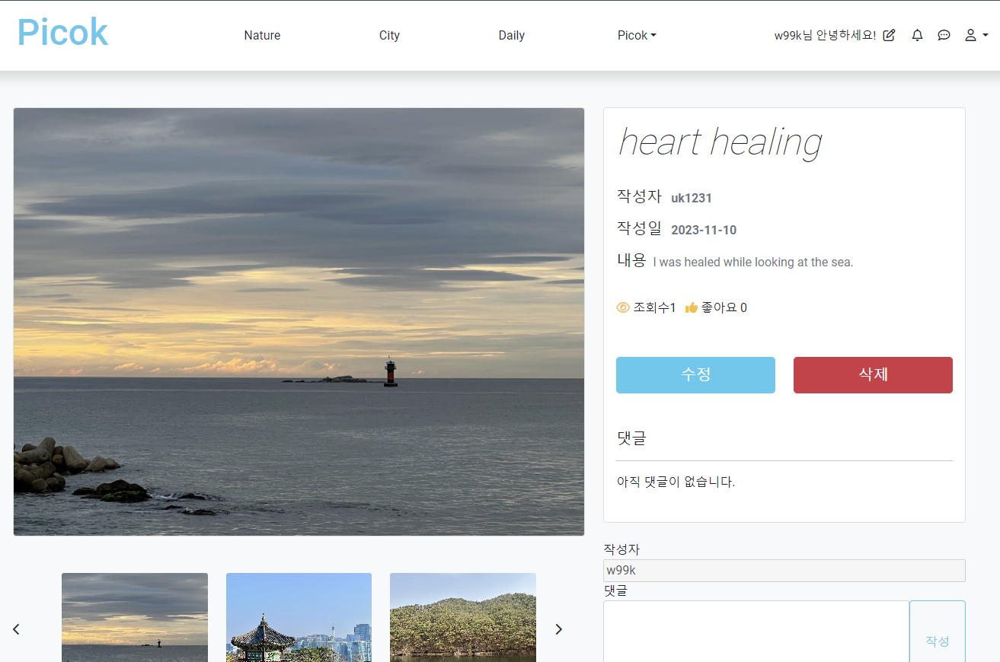
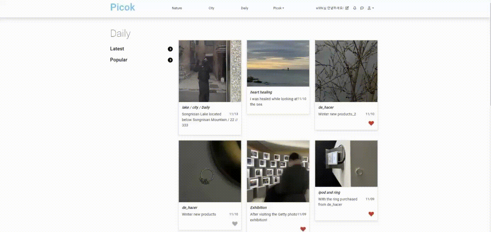

# Project_PICOK | 사진 아카이브 소셜미디어 - 글 작성

글 작성에 대한 설명 및 구동입니다.

### ✍️ 게시글 작성 ✍️

  

 

- 원하는 첨부파일(.jpg/.png)를 선택합니다.
- 'Nature', 'City', 'Daily' 중 원하는 카테고리(테마)를 설정합니다.
- 제목과 내용을 기입한 후 '작성하기' 버튼을 클릭하여 업로드 합니다.
- 게시글을 업로드하면 My Photo 페이지에 도달하게 되고, 내가 올린 게시글을 모두 볼 수 있습니다.
- 업로드한 카테고리에 접속하게 되면 최신순으로 업로드 된 게시글을 확인하실 수 있습니다.

### 🆙 카테고리 별 업로드 시연 🆙

- City 카테고리의 업로드 영상입니다.

  

  

- 게시글의 작성자는 수정/삭제 버튼이 활성화 됩니다.

 

- Daily 카테고리의 업로드 영상입니다.

  

  

 

- 게시글의 작성자는 수정/삭제 버튼이 활성화 됩니다.

### ✂️ 게시글 수정 및 삭제 ✂️

- 영상 시작을 주목하면 카테고리 'Nature'의 'lake'라는 게시글이 있는 것을 확인하실 수 있습니다.

  

 

- 'lake'라는 게시글을 카테고리 'city'의 게시글로 수정하면 수정된 게시글이 먼저 보이게 되고, 해당 카테고리를 확인했을 때 수정된 게시글이 보이게 됩니다.

  

 

- 카테고리 'City'의 'lake / City'라는 게시글을 수정합니다.
- 위와 마찬가지로 카테고리 'Daily'의 'lake / City / Daily'라는 게시글로 수정된 것을 확인할 수 있습니다.

  

 

- 게시글 삭제를 클릭하면 해당 게시글이 삭제되고, 게시판에서도 게시글이 삭제된 것을 확인할 수 있습니다.

👉 <a href="https://github.com/wooksun/Project_PICOK_Spring" target="_blank">Project_PICOK 보러가기</a> 👈
